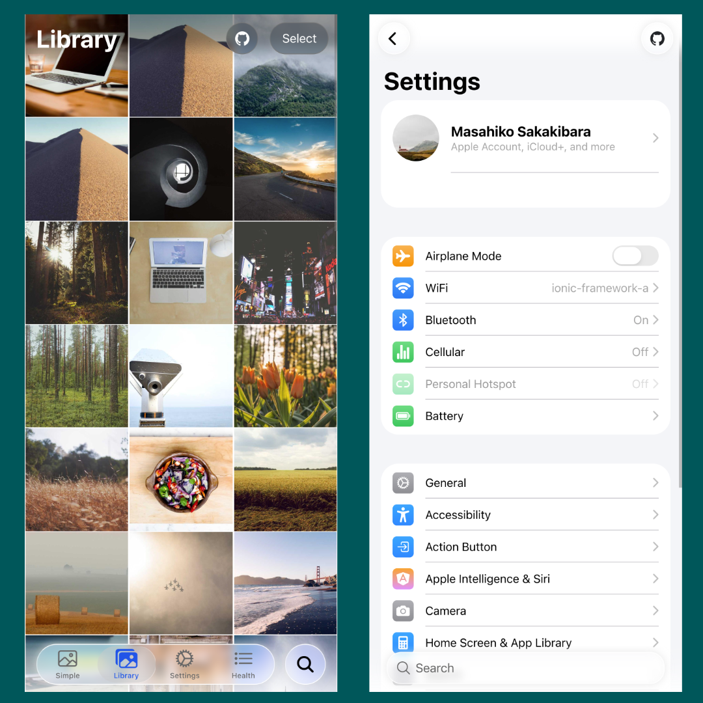

# Ionic Theme iOS26

A CSS theme library that applies iOS26 design system to Ionic applications.



DEMO is here: https://ionic-theme-ios26.netlify.app/

## Overview

This library provides CSS files to apply the iOS26 design system used in real projects to Ionic applications. It customizes the appearance and behavior of Ionic components based on the latest iOS26 design guidelines.

> **⚠️ Under Development**: This library is currently in the development and consideration phase as an OSS project, based on files copied from real projects. We are working on API stability and documentation improvement before full-scale use.

## 💖 Support This Project

Enjoying this project? Your support helps keep it alive and growing!  
Sponsoring means you directly contribute to new features, improvements, and maintenance.

[Become a Sponsor →](https://github.com/sponsors/rdlabo)

## Setup

> **⚠️ Warning**: This library is under development. API changes and breaking changes may occur before full-scale use.

### 1. Installation

```bash
npm install @rdlabo/ionic-theme-ios26
```

### 2. CSS File Import (Required)

Import the theme in your project's main CSS file (e.g., `src/styles.scss`) and set the `--max-safe-area` variable:

```scss
@import '@rdlabo/ionic-theme-ios26/css/ionic-theme-ios26.css';
@import '@rdlabo/ionic-theme-ios26/css/ion-list-inset.css';

/* Required: Safe area configuration */
:root {
  --max-safe-area: calc(max(10px, var(--ion-safe-area-bottom, 0px)) + var(--admob-safe-area, 0px));
}
```

> **Important**: The theme will not work correctly without the `--max-safe-area` setting. This configuration is mandatory.

### 3. Framework-specific Configuration Examples

#### For Angular Projects

Add CSS file to `angular.json`:

```json
{
  "styles": [
    "node_modules/@rdlabo/ionic-theme-ios26/css/ionic-theme-ios26.css",
    "node_modules/@rdlabo/ionic-theme-ios26/css/ion-list-inset.css"
  ]
}
```

**Required**: Set `--max-safe-area` in `src/styles.scss`:

```scss
:root {
  --max-safe-area: calc(max(10px, var(--ion-safe-area-bottom, 0px)) + var(--admob-safe-area, 0px));
}
```

#### For React Projects

Import CSS file in `index.js` or `App.js`:

```javascript
import '@rdlabo/ionic-theme-ios26/css/ionic-theme-ios26.css';
import '@rdlabo/ionic-theme-ios26/css/ion-list-inset.css';
```

**Required**: Set `--max-safe-area` in main CSS file:

```css
:root {
  --max-safe-area: calc(max(10px, var(--ion-safe-area-bottom, 0px)) + var(--admob-safe-area, 0px));
}
```

#### For Vue.js Projects

Import CSS file in `main.js`:

```javascript
import '@rdlabo/ionic-theme-ios26/css/ionic-theme-ios26.css';
import '@rdlabo/ionic-theme-ios26/css/ion-list-inset.css';
```

**Required**: Set `--max-safe-area` in main CSS file:

```css
:root {
  --max-safe-area: calc(max(10px, var(--ion-safe-area-bottom, 0px)) + var(--admob-safe-area, 0px));
}
```


## Development Status

This library is currently in the development and consideration phase. We are working on the following tasks:

- [ ] API stabilization
- [ ] Documentation improvement
- [ ] Test coverage enhancement
- [ ] Performance optimization
- [ ] Community feedback collection

## CSS Utility Class
__For development purposes, this is written in Japanese. It will be translated into English when it becomes stable.__

### .enable-back-button

Ionicでは、Pushで遷移したページは、Popが可能だとフラグを立てるためにPage Componentに `.can-go-back` が自動的に付与されます。しかし、 `ion-back-button` を設置していても、ダイレクトにそのページにアクセスした場合は `.can-go-back` は付与されないため、代替で手動で付与するためのClassです。

- `.ion-page.enable-back-button`

```typescript
const routePage = pageComponent.querySelector('.ion-page:not(.ion-page-hidden)');
if (routePage.querySelector('ion-back-button')) {
  routePage.classList.add('enable-back-button');
}
```

### .liquid-glass-buttons

`ion-buttons > ion-button` にiOS26デザインを適用するため、手動で付与するClassです。

- `ion-buttons.liquid-glass-buttons`

### .exclude-liquid-glass

多くのコンポーネントに自動的にiOS26デザインが適用されますが、適用したくない場合にClassを付与してください。

#### Support
- `ion-header > ion-toolbar > ion-buttons > ion-button.exclude-liquid-glass`
- `ion-popover.exclude-liquid-glass`

## Developer Information

### Build

```bash
ng build ionic-theme-ios26
```

### Test

```bash
ng test
```

## License

MIT License

## Contributing

This project is under development. We welcome feedback and suggestions:

- Issue reporting
- Feature requests
- Documentation improvements
- Code review participation

## Support

- **Under Development**: No formal support is provided
- **Feedback**: Please report issues on GitHub Issues page
- **Community**: Participate in developer community discussions
